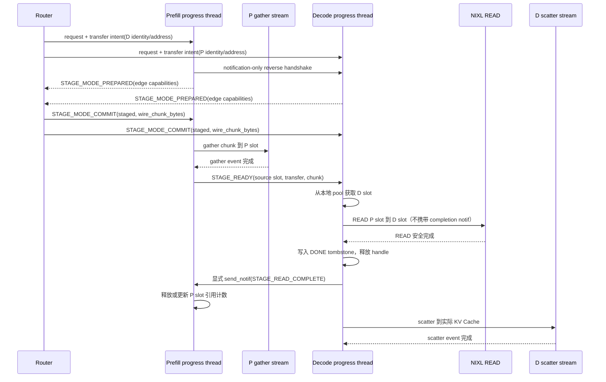

# NIXL GPU Staging Receiver-Pull 方案

## 摘要

本文提出一种 receiver-pull GPU staging 数据路径，用于降低大规模 KV Cache
传输中的 NIXL descriptor 构建和提交开销。

方案的核心流程是：

1. Router 在请求进入 P/D 前确定实际 P/D 配对，分配 `transfer_id`，并把同一份
   transfer intent 随两端请求元数据下发。
2. P 把离散 KV Cache gather 到自己的连续 staging slot。
3. P 向目标 D 发送 `READY`，通知数据已经可以读取。
4. D 从自己的 staging pool 选择空闲 slot，主动发起 NIXL READ。
5. D 观察到 NIXL READ 安全 `DONE` 后，先写入本地 `DONE` tombstone 并释放
   transfer handle，再显式、可重试地向 P 发送 `READ_COMPLETE`；P 收到后立即
   复用自己的 staging slot。
6. D 在本地把连续数据 scatter 到实际 KV Cache；该步骤不再阻塞 P slot。

```text
P 实际 KV       P staging                 D staging       D 实际 KV
非连续数据  ->  连续数据、等待读取  --READ-->  连续数据  ->  非连续数据
                P 自己管理                 D 自己管理
```

## 背景

直接在 P 和 D 的实际 KV Cache 之间传输时，每个 `(region, block)` 通常产生
一个 NIXL descriptor。大请求的 descriptor 数量近似为：

```text
descriptor_count = region 数量 * physical block 数量
```

当一个请求包含大量 block 和 layer 时，`make_prepped_xfer` 的 descriptor
准备成本可能明显高于实际数据移动成本。

GPU staging 把多个离散 page 先整理成连续 chunk。每个网络操作只使用一个
连续源 descriptor 和一个连续目的 descriptor，从而把 descriptor 数量降为：

```text
staged_descriptor_count ~= ceil(transfer_bytes / slot_bytes)
```

sender-push WRITE 可以实现相同的数据布局，但 P 在写入 D staging slot 前必须
获得远端 slot 的使用权。这会引入 credit 分配、epoch、超时回收和取消 drain
等跨节点资源管理。receiver-pull 改由 D 选择自己的目的 slot，从根源上移除
远端目的 slot 的授权问题。

## 目标

1. 每个 NIXL READ 只使用一个连续源 descriptor 和一个连续目的 descriptor。
2. 支持 P 和 D 数量不同，以及多 P、多 D 的稀疏通信拓扑。
3. P 和 D 独立配置 staging pool 大小和并发度。
4. staging 显存有固定上限，请求可以远大于任意一端的 pool。
5. 重叠 P gather、网络 READ 和 D scatter。
6. D 根据 decode 负载控制 READ 和 scatter 并发，避免传输失控地影响推理。
7. 保持现有 KV block mapping、completion、lease、invalid block 和 fallback
   语义。

## 非目标

- staging pool 不是 KV Cache，不参与 prefix caching 或 block 分配。
- 不压缩或量化 KV 数据。
- 不要求 P 与 D 数量、TP 或 EP 配置相同，但所有组合必须已经被 NIXL
  Connector direct 模式支持。
- 本方案不负责推导 TP/PP/EP 的 KV ownership；它消费 topology 层生成的
  source-to-destination transfer plan。
- 本实现不把多个请求的数据合并进同一个 slot。

## 通俗模型

可以把每个 P 看作一个供货点，每个 D 看作一个自提点：

```text
P0 准备好货物 ─┐
P1 准备好货物 ─┼── READY 队列 ──> D 有空时自行取货
P2 准备好货物 ─┘
```

P 只负责把数据放到自己的临时货架并通知 D。D 有本地空位时才来读取。P 的
货架满后暂停 gather，D 的货架满后暂停 READ，两端由各自的本地队列自然
形成背压。

Router 必须在请求进入 P/D 前确定请求级配对，而不是只选择一个仍会在内部随机
分发的 service URL。对于 DP 部署，Router 必须选择并固定实际 DP rank；TP rank
之间的传输边仍由 topology 层展开。Router 将 D 的 engine/rank/generation、通知
地址以及共同的 `transfer_id` 随 P 请求下发，同时将对应 P 信息随 D 请求下发。
因此不需要 D 再发送独立的 `PULL` 消息。P 和 D 的 physical block ID 仍然完全
本地化，不经过 Router 交换。

Router intent 默认覆盖该请求可传输的完整逻辑 prompt 范围。D 可以根据自己的
prefix cache 只 scatter 缺失范围；如果没有额外的精确 range refinement，网络
仍读取完整 wire range，以换取零 D 到 P 请求消息。部署若有准确、无竞态的
KV-aware Router，可以在 intent 中直接给出缺失逻辑范围。未来也可以增加可选的
D 到 P range refinement，但它只是带宽优化，不是启动 staged transfer 的必需
控制消息。

## 总体架构

### P 端 outbox

每个 P worker 分配一个连续 GPU staging pool，并切分为固定大小的 outbox
slot。P 的公平调度器从多个请求中选择下一个 chunk，gather 完成后发送
`READY`。

```text
P outbox
┌─────────────┬─────────┬───────────┬─────────┐
│ READY_LOCAL │ EXPOSED │ PACKING   │ FREE    │
└─────────────┴─────────┴───────────┴─────────┘
```

一个 P slot 在收到所有目标 D 的 READ_COMPLETE 或等价安全终态前不能复用；
不需要等待 D scatter。

P 没有 `READ_STARTED` 或 `CLAIM` 消息，因此无法可靠区分 READY 正在 D 排队
还是 READ 已经提交。只要 P 已经尝试发送 READY，source slot 就统一视为
`EXPOSED`：它可能已被远端观察，必须持有到 READ_COMPLETE、安全释放证明或
connection-level cleanup 完成。`READY_LOCAL` 只表示 READY 确定尚未进行首次
发送尝试；发送调用返回错误也可能无法证明消息未送达，因此发送尝试前必须先
进入 `EXPOSED`。

P 不跟踪 D inbox slot 或 scatter 状态。正常路径中，P 对 D 的唯一在途状态是
source slot 的 `pending_consumers`；对应 READ_COMPLETE 到达后立即删除 consumer
并继续 gather 后续 chunk。

### D 端 inbox

每个 D worker 维护来自所有 P 的 READY 队列，并管理自己的本地 staging pool。
D 有空闲 slot 和传输额度时，从 READY 队列公平选择一个 chunk，主动发起 READ。

```text
D inbox
┌─────────┬────────────┬─────────┐
│ READING │ SCATTERING │ FREE    │
└─────────┴────────────┴─────────┘
```

D slot 从不暴露给 P，也不需要跨节点 lease。

### 多 P、多 D

系统只建立 transfer plan 要求的连接，不建立 P×D 全连接：

```text
P0 ───────> D0
 └────────> D1
P1 ───────> D1
P2 ───────> D0
 └────────> D2
```

每个 D 合并来自多个 P 的 READY，并以 round-robin 或 deficit round-robin
调度，避免单个大请求或单个 P 独占 inbox。

如果同一个 P chunk 需要被多个 D 读取，P 为该 slot 维护目标集合：

```text
pending_consumers = {D0, D2}
```

每收到一个显式 `READ_COMPLETE` 或等价安全终态证明就移除对应 D；集合为空后
释放 P slot。
chunk planner 应优先让每个 chunk 只对应一个 D，以避免复制无关数据和延长
P slot 生命周期。
只有目标 D 的 `wire_chunk_bytes`、logical range 和 chunk boundary 完全相同时，
它们才能共享同一个 P chunk 和 source slot；否则 P 必须为每条 edge 分别规划和
gather。不能为了共享 slot 而让任一 D READ 超过自己的 slot 边界。

## TP、PP 与 EP

receiver-pull 不要求 P/D worker 数量相同，但 topology 层必须先生成明确的
传输边和 copy plan。

### TP

D rank 只拉取自己最终持有的 KV 分片。staging 支持同构 TP，也支持 direct
模式已经支持的异构 TP。P/D TP size 不同时，transfer plan 负责把 source
block slice 映射为各个 D rank 的目标 slice，每条实际传输边独立发送 READY。

异构 TP 沿用 direct 模式的约束：P/D TP size 必须成整数倍关系；Dense 和 MoE
模型支持双向 TP 扩缩；MLA KV Cache 在 TP rank 间复制，不执行普通的 head
splitting；Hybrid SSM/Mamba 当前要求 P/D TP size 相同；需要 head splitting
时沿用 direct 模式对 KV Cache layout 的要求。

### PP

NIXL Pull Connector direct 模式当前不支持 PP，因此 staging 模式同样不支持
P 或 D 的 `pipeline_parallel_size > 1`，也不实现 PP stage 间的 layer mapping。
NixlPushConnector 对 PP prefill 的支持不属于本方案的兼容基线。请求包含 PP
配置时必须在传输开始前 fail closed，不能只让部分 PP stage 进入 staging
模式。

### EP

EP 通常改变 MoE expert 的放置，而不直接改变 Attention KV Cache ownership。
只要 topology 层能确定 KV source 和 destination，传输协议不需要感知 expert
路由。如果 EP、DP 或 TP 组合改变 KV ownership，则按最终 KV owner 建立 READY
队列和 READ 连接。staging 支持 direct 模式已经支持的 MoE + EP、DP + EP 和
TP + EP 组合。MoE 的 `nixl_ep` all-to-all backend 与 KV staging 数据路径相互
独立，不改变 copy plan 或 wire layout。

## Copy Plan 与 Wire Layout

线上字节顺序沿用 direct descriptor path 的逻辑顺序。TP mapping、
physical/logical block mapping、MLA、HMA 和 Mamba region decomposition 都应
在 chunking 前完成。若 intent 提供可信的 prefix trimming range，也必须在此时
应用；否则 wire plan 覆盖完整逻辑范围，D 只对本地未命中的范围执行 scatter。

```text
StagingCopyPlan
  transfer_id
  producer engine/rank/generation
  consumer engine/rank/generation
  source region 和 block mapping
  destination region 和 block mapping
  total valid bytes
  chunk geometry
```

P 按 source plan gather，D 按 destination plan scatter。READY 只引用 plan 和
chunk，不重复发送 layer-by-block 地址数组。

source plan 的 logical range 来自 Router transfer intent。没有可信 KV-aware
range 时使用完整可传输范围；D 在 destination plan 中标记本地已命中的范围，
对应字节完成 READ 后不再 scatter。任何 range refinement 都必须在首个 chunk
开始 gather 前确定，不能在传输中途改变 wire layout。

本实现中每个 slot 只承载一个请求的一个 chunk。后续可以增加 frame table，
但不能为整个请求物化 `layers * blocks` 大小的 descriptor 数组。

## Slot 状态机

P slot：

```text
FREE -> PACKING -> READY_LOCAL -> EXPOSED -> FREE
```

- `PACKING`：gather CUDA event 尚未完成。
- `READY_LOCAL`：gather 已完成，但 P 可以确认尚未尝试发送 READY。
- `EXPOSED`：P 已尝试发送 READY，D 可能已排队或提交 READ。P 在收到
  所有 consumer 的安全终态前不能复用 slot。

每个 P slot 还维护一个在当前 producer generation 内单调递增且不回绕的
`source_slot_epoch`。slot 每次从 `FREE` 分配给新 occupant 时递增 epoch；READY、
READ_COMPLETE 以及每 chunk 的 STATUS 查询和回复都携带该 epoch。请求级 CANCEL
不携带单个 slot epoch，也不充当释放证明。epoch 是 slot occupant 身份的一部分，
不能以 `transfer_id` 或 `chunk_index` 代替。

D slot：

```text
FREE -> READING -> SCATTERING -> FREE
```

- `READING`：D 发起的 NIXL READ 尚未到达终态。
- `SCATTERING`：READ 已完成，scatter CUDA event 尚未完成。

D 还必须独立维护每个远程 chunk 的提交状态：

```text
NOT_SEEN -> QUEUED -> POSTING -> INFLIGHT -> DONE
QUEUED -> ABORTED
POSTING or INFLIGHT -> UNKNOWN
```

- `POSTING` 是 READ 提交与 CANCEL 之间的安全边界。一旦进入该状态，
  除非 backend 明确证明 READ 从未提交或已经安全结束，否则不得返回
  `SAFE_NOT_SUBMITTED` 或 `SAFE_COMPLETE`。
- `UNKNOWN` 表示提交返回异常或查询状态失败，无法确认远程内存
  是否仍可能被访问。

slot 状态和 chunk 提交状态都只由 D progress thread 修改。该串行化
规则必须保证 CANCEL 与 `POSTING` 的先后关系可判定。

所有 slot 状态只由其所在 worker 的 progress thread 修改。其他线程通过本地
queue 提交工作。

## 传输协议

### Handshake

handshake metadata 至少包含：

```text
protocol_version
engine_id
rank
generation
staging_pool_base_addr
staging_pool_bytes
staging_slot_bytes
staging_slot_count
supported_features
```

只有 P 的 pool 地址需要被远端 READ。D pool 可以注册到本地 NIXL agent，但
不需要把 slot 分配状态发送给 P。

现有 Pull Connector 的首次 handshake 是 D 到 P 的单向连接。Router intent 将
D side-channel 地址、实际 DP rank 和 TP size 同时提供给 P，因此 P 可以直接发起
反向 handshake，获得只用于控制通知的 D agent。反向 handshake 不准备 D KV
Cache 或 staging descriptor；P 不能通过该连接读写 D staging pool。该流程复用
NixlPushConnector 的 notification-only reverse handshake 模式。

handshake 只完成 capability discovery，不授权任何一端开始 staged gather 或
direct transfer。Router 收集请求全部 source edge 的 handshake/preflight 结果后，
为每条 edge 计算：

```text
wire_chunk_bytes = min(P staging_slot_bytes, D staging_slot_bytes)
```

并在请求级 `MODE_COMMIT` 中冻结该值。P 必须等反向 handshake 和请求级
`MODE_COMMIT(staged)` 都成功后才能构建 chunk plan、分配 source slot 或提交
gather。由于 chunk boundary 依赖 D slot 大小，handshake 只能与 P 的请求执行和
source lease 获取并行，不能与 staged gather 并行。handshake 或 preflight 失败时，
P 不发送 READY，并等待 Router 提交 direct fallback 或 fail 决定。

`generation` 标识一次 worker/connection 生命周期。连接重建后必须使用新的
generation，旧 generation 的 Router intent、READY、READ_COMPLETE、CANCEL 和
STATUS 消息全部丢弃。
每条控制消息同时携带 producer 和 consumer generation；只校验 producer
generation 无法阻止 D 重启前排队的 READY 被新 D 实例消费。

### 控制消息

| 消息 | 方向 | 用途 |
| ------ | ------ | ------ |
| `STAGE_READY` | P 到 D | 某个 P slot 的 chunk 已完成 gather，可以 READ。 |
| `STAGE_READ_COMPLETE` | D 到 P | D 观察并记录安全 `DONE` 后显式发送的、可重试的 source-slot 释放证明。 |
| `STAGE_CANCEL` | 双向 | 请求取消；接收方停止未开始工作并安全 drain 在途操作。 |
| `STAGE_STATUS_QUERY` | P 到 D | 超时或通知状态不确定时查询 chunk 安全终态。 |
| `STAGE_STATUS_REPLY` | D 到 P | 返回带 tombstone 的未提交证明、完成证明或不确定状态。 |

Router control plane 另外定义请求级模式协商消息；它们不通过 NIXL notification
发送：

| 消息 | 方向 | 用途 |
| ------ | ------ | ------ |
| `STAGE_MODE_PREPARED` | P/D worker 到 Router | 报告 edge capability、generation、slot geometry 和准备结果。 |
| `STAGE_MODE_COMMIT` | Router 到全部 P/D worker | 原子提交该请求使用 staged、direct 或 fail，并携带每条 edge 的 `wire_chunk_bytes`。 |
| `STAGE_MODE_ABORT` | Router 到全部 P/D worker | preflight 超时或参与者变化时撤销本次尚未提交的 attempt。 |
| `STAGE_MODE_QUERY` | P/D worker 到 Router | Router 重启、投递中断或 worker 重连时查询持久化的模式决定。 |

建议使用 msgspec typed struct，而不是无 schema 的字典。

Router 随 P/D 请求下发的 transfer intent 至少包含：

```text
StagingTransferIntent
  protocol_version
  producer_generation
  consumer_generation
  transfer_id
  producer_request_id
  consumer_request_id
  producer_engine_id / producer_rank / producer_tp_size
  consumer_engine_id / consumer_rank / consumer_tp_size
  producer_host / producer_port
  consumer_host / consumer_port
  source_ranges_by_group（可选；缺省表示完整可传输范围）
  plan_id
  mode_attempt
```

`mode_attempt` 标识一次模式协商。Router 重试 preflight 时必须递增 attempt；worker
只接受当前 generation 下最新 attempt 的 COMMIT/ABORT，旧 attempt 不得启动传输。

Router 为每条请求选择 P/D 实例和实际 DP rank，topology 层再展开实际 TP source
edge；不建立 P×D 全连接。P 根据 `producer_request_id` 找到自己的 source block
table，按 `source_ranges_by_group` 选择逻辑区间，并结合 consumer rank/TP size
和 topology 构建 source plan。区间使用每个 group 的 `(start, count)` 紧凑表示，
必要时一个 group 可以包含多个区间；没有可靠的 D prefix-cache 状态时使用完整
可传输范围。intent 不重复发送 P 已持有的 physical block ID，也不发送 D 的
destination block mapping 或任一端的 `layers * blocks` descriptor 数组。

P/D 按 `(producer_generation, consumer_generation, transfer_id,
producer_engine_id, consumer_engine_id)` 去重 Router intent。完全相同的请求重试
是幂等的；同一键但请求身份或 topology 参数不同必须 fail closed。intent 与 P
请求完成、D block 分配可以任意先后到达：P progress thread 匹配 intent 和
finished source block table 后进入 PREPARED；D progress thread 匹配 intent 和本地
destination plan 后进入 PREPARED。两端都只能在收到同一 mode attempt 的
MODE_COMMIT(staged) 后开始 gather 或消费 READY。

READY 可以包含：

```text
STAGE_READY
  protocol_version
  producer_generation
  consumer_generation
  transfer_id
  request_id
  chunk_index
  source_slot_id
  source_slot_epoch
  valid_bytes
  plan_id
  producer_engine_id
  producer_rank
  consumer_engine_id
  consumer_rank
```

READY 使用以下完整身份键去重：

```text
(producer_engine_id, producer_rank, producer_generation,
 consumer_engine_id, consumer_rank, consumer_generation,
 transfer_id, chunk_index, source_slot_id, source_slot_epoch)
```

P 在首次发送 READY 后没有收到终态或 `INFLIGHT` 证明时，以有界频率重发同一
READY。重发不改变身份键、chunk geometry 或 slot 内容；确认 `INFLIGHT` 后停止
READY 重发，改由 STATUS 对账和 timeout policy 跟踪。D 对相同键最多提交一次
READ；`QUEUED`、`POSTING`、`INFLIGHT`、`DONE`、`ABORTED` 和 `UNKNOWN` 状态下的
重复 READY 均不得创建第二个 READ。P 收到终态时还必须确认该键与 source slot
当前 occupant 完全一致，迟到的旧终态不能递减新 occupant 的
`pending_consumers`。

READ_COMPLETE 可以包含：

```text
STAGE_READ_COMPLETE
  protocol_version
  producer_generation
  consumer_generation
  transfer_id
  chunk_index
  source_slot_id
  source_slot_epoch
  producer_engine_id
  producer_rank
  consumer_engine_id
  consumer_rank
```

staging 路径的 NIXL READ 不携带 completion `notif_msg`；现有 direct pull 路径的
兼容行为不在本方案中改变。D progress thread 必须按以下顺序处理安全完成，顺序
不得颠倒：

```text
check_xfer_state() == DONE
  -> 原子写入 DONE tombstone
  -> release_xfer_handle()
  -> 把 STAGE_READ_COMPLETE 放入本地 completion outbox
  -> send_notif()，失败或结果不确定时重发同一消息
```

发送重试不改变完整身份键，P 对重复消息幂等去重。`send_notif()` 返回成功只表示
控制消息已提交，不是 READ 安全完成的证据；安全性只来自先前观察并记录的
`DONE`。P 收到该消息即可确认远端不会继续访问 source slot；D scatter 是否
完成、成功或取消不影响 P slot 的安全复用。

D 必须在发送前安装 tombstone，使进程仍存活时即使在 `DONE` 与首次发送之间
失败，STATUS_QUERY 也能返回 `SAFE_COMPLETE`。completion outbox 至少保留到
一次发送成功；发送结果不确定时允许重复投递。若 D 在 tombstone 尚未持久化时
进程退出，则不能依赖重启后的空状态证明安全，只能通过 generation teardown
屏障或重启持有 staging pool 的 worker 收敛。

CANCEL 可以包含：

```text
STAGE_CANCEL
  protocol_version
  producer_generation
  consumer_generation
  transfer_id
  producer_request_id
  consumer_request_id
  consumer_engine_id / consumer_rank
```

STAGE_CANCEL 只表达请求级取消意图，永远不能直接使 P 复用 source slot。D 必须
针对每个已出现的 chunk，以携带完整 READY 身份键的 STATUS_REPLY 返回
`SAFE_NOT_SUBMITTED`、`SAFE_COMPLETE`、`SAFE_RETIRED`、`INFLIGHT` 或
`UNKNOWN`。前三种结果能释放该 chunk 对应的 consumer 引用，其中
`SAFE_RETIRED` 只证明 source slot 安全，不能证明数据传输成功。正常成功路径始终
使用上述显式、可重试的 READ_COMPLETE。

STATUS_QUERY/STATUS_REPLY 只用于异常恢复，不参与正常数据路径。两者携带与 READY
相同的完整身份键；STATUS_REPLY 的状态为：

```text
SAFE_NOT_SUBMITTED
INFLIGHT
SAFE_COMPLETE
SAFE_RETIRED
UNKNOWN
```

- `SAFE_NOT_SUBMITTED`：D 已在 progress thread 中把该键原子地置为 `ABORTED`
  tombstone，确认从未进入 `POSTING`；迟到或重发的 READY 将被丢弃。
- `SAFE_COMPLETE`：D 已观察到 backend 的安全完成状态，并保留 `DONE`
  tombstone。它可以在显式 READ_COMPLETE 丢失时作为等价的释放证明。
- `SAFE_RETIRED`：查询 epoch 低于该 source slot 的 high-watermark；D 曾观察到该
  epoch 的安全终态后才推进 watermark。它只用于旧消息对账，不表示数据成功。
- `INFLIGHT` 和 `UNKNOWN` 都不能使 P 释放 slot。

如果 D 无法提供匹配 generation 和完整身份键的安全回复，P 必须继续持有 slot，
转入 connection-level cleanup。STATUS_REPLY 不能仅根据“请求已取消”或 wall-clock
timeout 声明安全。

D 的本地 slot ID 不需要出现在任何远程消息中。所有 typed control message 使用
固定 notification prefix 与现有 heartbeat、direct completion 和 push
registration 区分；prefix 匹配但解码或 schema 校验失败的消息必须丢弃并计数，
不能回退成 legacy completion 字符串解析。

### 正常时序



P 只有在 gather event 完成后才能发送 READY。D 只有在 READ 到达安全终态后
才能开始 scatter；D 只有在 scatter event 完成后才能复用 D slot。P 在收到所有
目标 D 的 READ_COMPLETE 后即可复用 P slot，不等待 scatter。

Router intent 不预留任何 D slot，也不表示 READ 已经开始。D 可以在收到 intent
后因本地负载暂停消费 READY；此时背压最终停在 P outbox，而不是形成跨节点
credit 或隐式目的 slot lease。

### 请求级模式选择

Router 是请求级模式协商的唯一 coordinator。模式选择使用以下两阶段流程：

1. Router 生成带 `mode_attempt` 的 intent，P/D 暂存请求并完成所有实际 TP edge
   的 handshake、parallel mapping 和 staging capability preflight。每个 worker 向
   Router 返回 `STAGE_MODE_PREPARED`，但不得开始 gather、READ 或 direct transfer。
2. Router 只有在全部预期 P/D worker 对同一 attempt、engine/rank/generation 和
   edge 集合返回成功后，才广播一个不可变的 `STAGE_MODE_COMMIT(staged)`；commit
   同时携带完整 edge 集合及每条 edge 的 `wire_chunk_bytes`。任一 edge 不支持时，
   Router 根据 `staging_fallback` 向所有参与者统一提交 direct 或 fail。

worker 必须持久记录当前请求已接受的 commit。只有接受同一 attempt 的 commit 后
才能启动对应数据路径；本地 capability 结果不能代替 commit。重复 commit 必须
幂等，同一 attempt 内容不同必须 fail closed。commit 后不允许把单个 edge 本地
回退到另一模式；参与者失败时取消整个 transfer，并由 Router 使用新的
`transfer_id` 和 `mode_attempt` 重试。

Router 必须在发送第一条 COMMIT/ABORT 前，把 `(transfer_id, mode_attempt)` 的
唯一决定写入可在 Router 重启后恢复的 durable/replicated state。广播不要求同时
到达：先收到 COMMIT 的 worker 可以启动已提交模式，尚未收到的 worker只能等待或
发送 `STAGE_MODE_QUERY`，不能自行 fallback。Router 重启或部分投递失败后必须重放
同一决定。决定记录至少保留到所有参与者确认请求终态；若记录不可恢复，相关
worker 只能取消和安全 drain，不能猜测另一模式。

preflight 超时或参与者 generation 改变时，Router 广播 `STAGE_MODE_ABORT`。ABORT
只作用于尚未 commit 的 attempt；COMMIT 与 ABORT 冲突时 fail closed，不能由到达
顺序任意决定结果。这样任一 TP/DP rank 都不能在其他 rank 仍等待 handshake 时
单独进入 direct 或 staged 路径。

### Router 配对与重试契约

Router 必须在发送 P 请求前获得可寻址的 D worker identity，或从稳定的服务注册
信息中解析它。只确定 D service 而不固定内部 DP rank 不满足该契约。Router 不
需要知道任一端的 physical block ID，也不参与 staging slot 分配。

同一 `transfer_id` 必须始终绑定相同的 P/D engine、rank 和 generation。Router
可以重复投递完全相同的请求；P/D 按 intent key 幂等处理。如果 D1 失败后改派
D2，Router 必须创建新的 `transfer_id`，并取消或清理 D1 对应的旧 transfer；不能
让旧 READY 被 D2 消费。P 失败后改派同理。

Router 可以先后或并行投递 P/D 请求。P 先完成时，READY 保留在有界 outbox，
直到 D 完成初始化后消费；D 先到达时等待 READY。这里的“P 先完成”表示 prefill
计算和 source lease 已就绪；在 MODE_COMMIT 前不能提前 gather staged chunk。
请求投递超时只能触发模式 ABORT、取消和 peer cleanup，不能直接证明远端
staging slot 已经可以安全复用。

## 队列与背压

P 和 D 分别维护本地上限：

```text
P 可继续 gather <=> P 有 FREE outbox slot
D 可继续 READ   <=> D 有 FREE inbox slot 且未达到 READ 并发上限
```

不需要 remote slot credit。D 变慢时，READY 在 D 排队，P outbox 最终填满并
停止 gather，形成自然背压。

建议的公平性约束：

- P 使用 request-level round-robin，防止大请求占满 outbox。
- D 使用 producer/request 两级 round-robin，防止单个 P 独占 inbox。
- 限制每个 request 的 READY 数量。
- 限制 D 全局 READ 数量、每个 P 的 READ 数量和在途字节数。
- Decode 繁忙时，D 可以暂停启动新的 READ，但必须继续轮询和 drain 已在途操作。

## Descriptor 与 Handle 缓存

P staging pool 和 D staging pool 都只注册一次。完整 slot descriptor 为：

```text
(pool_base + slot_id * slot_bytes, slot_bytes, device_id)
```

D 是 READ 发起方，可以在 handshake 后缓存：

- 每个本地 D slot 的完整目的 dlist；
- 每个 `(producer, source_slot)` 的完整源 dlist；
- tail chunk 按 `(producer, source_slot, local_slot, valid_bytes)` 使用小型 LRU。

完整 chunk 不应重复执行 descriptor-list preparation。tail chunk 不能默认读取
整个 slot，以免浪费带宽或读取上一个请求的残留字节。

## Completion 与 KV Lease

D 只有在全部必要 chunk scatter 完成后才能上报 `finished_recving`。
READ_COMPLETE 只证明 D 已观察并记录网络 READ 安全离开 P source slot，不表示
D 请求已经完成，也不能直接触发 `finished_recving`。

P 的源 KV block lease 至少要保留到对应数据已经 gather 到稳定的 P staging
slot。如果现有 scheduler 只能按请求整体释放 lease，则在该请求所有 chunk
完成 gather 前继续保留；P staging slot 则必须保留到目标 D 显式发送
READ_COMPLETE、返回等价安全 STATUS_REPLY、安全取消确认或 connection-level
cleanup 屏障完成。安全终态后 P 可以释放 slot，即使 D scatter 仍在进行。

传输失败后是否重试、重算或让请求失败，应复用现有 load-failure policy。
不能因为 P 已完成 gather 就向 D 报告接收成功。

## 取消、失败与资源安全

### Backend 安全契约

staging 模式启用前必须为实际 NIXL backend 验证以下契约，不能从 API 名称或
transfer handle 已释放推断内存安全：

- `transfer()` 返回或抛出异常时，能够区分“确定从未提交”和“可能已提交”；后者
  必须进入 `UNKNOWN`。
- `DONE` 明确保证 READ 不会继续访问 P source memory，并允许 D 生成
  `SAFE_COMPLETE` 证明。
- `ERR`、查询异常和 `release_xfer_handle()` 本身不构成安全证明，除非 backend
  文档和故障注入测试明确保证此时 DMA 已终止。
- transfer drain、connection teardown、agent teardown 或 memory deregistration
  中至少有一个操作可作为屏障，完成后保证该 generation 的旧 READ 不会再访问
  staging pool。仅观察到 socket 断开或 peer heartbeat 超时不等价于该屏障完成。
- D 本地记录 `DONE` 与 P 收到显式 READ_COMPLETE 之间允许发生进程或通知
  故障；此时 STATUS_QUERY/STATUS_REPLY 对账或上述 teardown 屏障必须能够收敛。

如果 backend 不能提供这些保证，staging 模式必须 fail closed，而不是依赖超时
复用 slot。实现应先用独立的 NIXL failure-semantics 测试覆盖提交异常、`ERR`、
通知丢失和连接销毁，再接入请求生命周期。

实现必须维护按 NIXL version、transport/backend 和 memory type 区分的安全能力
矩阵，不能用一个全局布尔值代表所有部署：

| 能力 | 启用 staging 所需证据 |
| ------ | ------ |
| definitely-not-submitted | API/返回码能把未提交与提交结果未知区分开，并有故障注入测试。 |
| safe DONE | backend 文档保证 DONE 后不再访问 source/destination memory，并有并发复用测试。 |
| explicit completion control | D 只在写入 DONE tombstone 并释放 handle 后发送；消息可重试、可去重，丢失时可通过本地 DONE 对账。 |
| drain/cancel barrier | 对已知 transfer 可等待到不会再 DMA，或明确标记为不支持。 |
| teardown barrier | connection/agent/generation teardown 后可证明旧 READ 不再访问注册内存。 |

启动时根据实际 backend 选择矩阵条目。正常完成、提交不确定和 peer failure 所需的
能力必须全部有证据；缺少 drain 时只有经验证的 teardown barrier 可以替代，二者
都缺少时该 backend 不得启用 staging。版本升级或 backend 切换必须重新验证，不能
继承另一版本或 transport 的结论。

### 请求取消

- Router intent 尚未到达 P：只清理 D 本地请求；Router 必须阻止或取消迟到的
  P 请求。
- intent 已到达 P、P 尚未 gather：D 或 Router 发送 CANCEL；P 从 pending
  intent 和 gather ready queue 删除该 consumer。
- gather 已提交到 CUDA stream：即使请求取消，P 也必须等 gather event 完成后
  才能复用 slot；如果 READY 确定尚未进行首次发送尝试，event 完成后可以直接
  释放。
- P 已 gather、D 尚未 READ：D 发送 CANCEL，明确确认没有提交 READ 后，P 才能
  释放 source slot。若 CANCEL 与 READ 提交存在竞争，则按在途 READ 处理。
- D 正在 READ：不能立即复用任一端 slot；成功 READ 在 D 观察并记录安全 DONE
  后显式发送 READ_COMPLETE。失败时只有 backend 明确保证不再访问 source memory 后，D
  才能针对该 chunk 返回 `SAFE_COMPLETE`；否则返回 `UNKNOWN` 并进入 drain。
- D 正在 scatter：P slot 已因 READ_COMPLETE 释放；D 等 CUDA event 完成后
  丢弃结果并释放自己的 slot。

P 不需要额外的 CLAIM 消息，因为 READY 后始终保留 source slot，直到收到
READ_COMPLETE、安全取消确认或安全 STATUS_REPLY。Router intent、READY、
CANCEL、STATUS 和 READ_COMPLETE 都必须幂等；晚到的 intent 不能复活已经
tombstone 的 transfer。

为避免 terminal tombstone 随请求数无界增长，D 不按 transfer 永久保存去重记录，
而是为每个
`(producer_engine_id, producer_rank, producer_generation, source_slot_id)` 保存
固定大小的 `highest_source_slot_epoch` 和该 epoch 的 chunk 状态。处理 READY 时：

- epoch 小于 high-watermark：这是旧 occupant 的迟到消息，直接丢弃；
- epoch 等于 high-watermark：按当前状态幂等处理，不能创建第二个 READ；
- epoch 大于 high-watermark：只有旧 epoch 已进入安全终态时才能推进 watermark，
  然后用新 occupant 状态替换旧 tombstone；否则将 peer 标记为协议错误并 fail
  closed。

P 只有在收到旧 epoch 的安全终态后才会复用 source slot，因此正常协议中 D 看到
更大 epoch 本身也是旧 occupant 已结束的佐证，但 D 仍必须在本地先观察到旧状态
terminal，不能仅信任消息到达顺序。high-watermark 在 producer generation 存活期
内不删除、不回绕；其空间复杂度为远端 P slot 数量，而不是历史 chunk 数量。
generation teardown 并经过 backend 屏障后才能整体删除对应 watermark。这样即使
通知层没有最大消息生存期，迟到 READY 也不能读取已经换 occupant 的 source slot。
对低于 watermark 的 STATUS_QUERY，D 返回 `SAFE_RETIRED`，但不能据此声称该旧
chunk 的数据曾成功 READ 或 scatter；该回复只证明 source slot 可安全复用。

### 超时与异常收敛

超时是故障检测信号，不是 GPU 内存安全证明。按观测状态采取以下动作：

| P/D 观测状态 | timeout 后动作 | P slot 是否可释放 |
| ------ | ------ | ------ |
| READY 确定尚未首次发送 | 本地取消；等待可能的 gather event | event 完成后可以 |
| D 以 tombstone 确认未进入 `POSTING` | 返回 `SAFE_NOT_SUBMITTED` | 可以 |
| `POSTING`、`INFLIGHT` 或提交结果不确定 | 停止新 READ，查询并 drain | 不可以 |
| D 已记录安全 `DONE`，显式通知丢失 | 重发 READ_COMPLETE 或返回 `SAFE_COMPLETE` | 可以 |
| peer 或连接丢失 | teardown 对应 generation 并等待 backend 屏障 | 屏障完成后可以 |

每个 peer 的异常恢复按以下顺序升级：

```text
chunk timeout
  -> 停止该 peer 的新 READY 消费和 READ 提交
  -> quarantine 状态不确定的 P/D slot
  -> STATUS 对账并 drain 已知 transfer
  -> teardown connection/agent 并 retire generation，拒绝旧 generation 消息
  -> 重启持有 staging pool 的 worker，或保持 fail-closed unavailable
```

quarantine 必须有显式的 slot/bytes 上限和指标。达到阈值后应立即把 peer 标记为
不可用并触发 connection-level cleanup；不能继续接收工作直到整个固定 pool 被
未知 READ 耗尽。若 teardown 后仍无法得到 backend 安全证明，进程存活期间不得
复用相关 GPU memory，最终收敛手段是重启持有该 pool 的 worker。

### NIXL 状态未知

如果 D 无法确认 READ 是否结束：

- D slot 必须 quarantine，不能放回 free pool；
- P 不会收到 READ_COMPLETE，因此 source slot 同样不能复用；
- 只有 transfer drain、连接销毁或 backend 明确保证不再访问内存后才能回收。

普通 wall-clock timeout 只能触发诊断和连接清理，不能作为复用 GPU slot 的安全
依据。

### Peer 丢失

D 丢失时，P 对应的 EXPOSED slot 进入 peer cleanup。P 只有在确认远端
connection 不再可能发起或继续 READ 后才能复用这些 slot。

P 丢失时，D 停止消费其 READY，drain 已提交 READ，并让相关请求进入现有
recompute/failure 路径。

## 显存与配置

P/D staging pool 都是每个 worker 的独立配置，不要求大小相同。staging 显存
必须在 KV Cache sizing 前扣除：

```text
available_kv_cache_bytes = profiled_available_bytes - staging_pool_bytes
```

`staging_buffer_bytes` 在 worker profiling 前即可确定；fraction 配置按该 worker
的 device total memory 解析并向下对齐到完整 slot。memory planner 必须把解析后
的字节数作为 connector reservation 从每个 worker 的 available KV memory 中
扣除，然后才能计算 block 数量。`register_kv_caches` 只能分配已经预留的 pool，
不能在 KV Cache 已经占满 profiled budget 后再做一笔未计入 sizing 的 GPU 分配。

显式配置 `kv_cache_memory_bytes` 时，该值仍只表示 KV Cache 本身；启动校验必须
确认 `kv_cache_memory_bytes + staging_pool_bytes` 不超过 worker 的可用预算。P 和
D 分别解析自己的配置，不交换或强制相同 pool/slot 数量。实际 chunk 大小取该
transfer edge 的已提交 `wire_chunk_bytes` 和剩余 valid bytes 的最小值；其中
`wire_chunk_bytes` 已由 preflight 固定为 P/D slot bytes 的最小值。

建议配置：

| 配置 | 含义 |
| ------ | ------ |
| `staging_buffer_fraction` | 当前 worker GPU 显存中用于 staging 的比例。 |
| `staging_buffer_bytes` | 绝对 staging 字节数，优先于 fraction。 |
| `staging_slot_bytes` | slot 目标大小。 |
| `staging_max_inflight` | D 同时在途的 READ 上限。 |
| `staging_max_inflight_per_peer` | D 对单个 P 的 READ 上限。 |
| `staging_max_ready_per_request` | P 允许单请求占用的 outbox slot 上限。 |
| `staging_ready_retry_interval` | EXPOSED chunk 重发相同 READY 的最小间隔。 |
| `staging_transfer_timeout` | 触发 STATUS 对账和 peer cleanup 的诊断超时。 |
| `staging_quarantine_max_bytes` | 触发 peer unavailable 和 connection teardown 的隔离字节阈值。 |
| `staging_fallback` | unsupported plan 时选择 direct 或 fail。 |

P 并发压力较大时，可以为 P 配置更多 outbox slot；D 使用较小 pool 和更低
READ 并发，按 decode latency 目标控制消费速度。

## 线程与 CUDA Stream

每个 worker 使用单独的 staging progress thread，独占：

- NIXL notification 和 transfer API；
- staging slot 状态；
- intent/READY/READ_COMPLETE/CANCEL/STATUS 状态；
- handle 和 descriptor cache。

P 使用 gather stream，D 使用 scatter stream。除 staging pipeline 内部顺序外，
还必须与两端 model execution stream 建立显式依赖：

1. P 在最后一个可能写入 source KV 的 model execution stream 上记录
   `source_ready_event`。source block lease 在该 event 被记录前不能交给 staging。
2. P gather stream 先 `wait_event(source_ready_event)`，再读取实际 KV 并写入 P
   slot。只有 gather stream 上的 `gather_done_event` 完成后才能发送 READY。
3. D 只有在 NIXL 报告 READ 安全完成后才能让 scatter stream 读取 D slot；scatter
   完成后在该 stream 上记录 `scatter_done_event`。
4. D scheduler 只有在全部必要 chunk 的 `scatter_done_event` 完成后才能上报
   `finished_recving`。请求首次进入 decode model execution stream 前，该 stream
   必须 `wait_event` 对应的 scatter completion；如果 progress thread 已同步确认
   event 完成，该 wait 可以成为 no-op，但不能只依赖 block lease 或 CPU queue 的
   先后关系。

取消也不能绕过这些依赖：已提交 gather 必须等待 `gather_done_event` 后才能释放
未暴露的 P slot；已提交 scatter 必须等待 `scatter_done_event` 后才能释放 D slot
或允许 block allocator 复用 destination KV。全流程不能使用 device-wide
synchronize。

至少三个 slot 时可以形成：

```text
时间       t0              t1              t2              t3
P GPU      gather C0       gather C1       gather C2       gather C3
网络                       READ C0         READ C1         READ C2
D GPU                                      scatter C0      scatter C1
```

## 指标

至少记录：

- P/D pool bytes、slot bytes 和各状态 slot 数量；
- READY queue 长度和等待时间，按 P、D、request 聚合；
- gather、READ、scatter bytes 和 duration；
- D 全局/per-peer 在途 READ 数量；
- D chunk 的 QUEUED、POSTING、INFLIGHT、UNKNOWN 和 terminal 状态数量；
- descriptor cache hit rate 和 NIXL post time；
- 每个请求的 chunk、目标 D 数量和完成进度；
- READY 重试和去重、STATUS 对账及各回复状态的次数；
- cancel、retry、quarantine bytes、peer cleanup、generation teardown、worker
  restart 和 fallback 次数；
- Decode ITL/TPOT 变化以及 P 端 TTFT、吞吐变化。

## 测试计划

### Unit test

- P/D pool 大小和 slot 数量不同；
- 多 P READY 合并及 producer/request 公平性；
- 一个 P 服务多个 D，以及 slot 引用计数；
- Router intent/READY/READ_COMPLETE/CANCEL/STATUS 重复、迟到、错误 generation
  和错误 peer；
- READY 首次发送返回成功、返回异常和结果不确定时，P slot 均遵守 EXPOSED
  边界；重复 READY 永远不会创建第二个 READ；
- source slot 复用后，旧 occupant 的 READY、STATUS_REPLY 和 READ_COMPLETE
  不能修改新 occupant 的引用计数；
- P/D slot 不同时，只有 MODE_COMMIT 冻结 `wire_chunk_bytes` 后才能构建 plan 或
  提交 gather；不同 chunk geometry 的 consumer 不能共享 P slot；
- 部分 TP edge preflight 失败、PREPARED/COMMIT/ABORT 重复和乱序、generation 在
  preflight 中变化时，所有 rank 均做出相同模式决定且 commit 冲突 fail closed；
- Router 在持久化决定后、广播完成前重启时，MODE_QUERY/重放使所有 worker 最终
  收到同一决定，未收到决定的 worker 不会自行 fallback；
- Router 固定 DP rank，以及同一 transfer 不允许静默改派 peer；
- 无 KV-aware range 时读取完整 wire range，但不 scatter D 已命中的 prefix；
- 精确 source range 必须在首个 gather 前冻结；
- READ_COMPLETE 到达后 P slot 可在 D scatter 完成前安全复用；
- NIXL READ 不携带 completion `notif_msg`，每个安全 DONE 只进入一个可重试的
  显式 READ_COMPLETE outbox；
- cancel 位于 gather、READY、READ 和 scatter 各阶段；
- CANCEL 与 POSTING 的两种顺序，以及 `transfer()` 抛出异常后的 UNKNOWN 状态；
- READ 状态未知时两端 slot 都不会过早复用；
- 显式 READ_COMPLETE 丢失时，SAFE_COMPLETE 对账可以释放 slot；不匹配的
  generation、身份键和无 tombstone 回复不能释放 slot；
- SAFE_NOT_SUBMITTED 先安装 ABORTED tombstone，再拒绝迟到 READY；
- `source_slot_epoch` 小于 watermark 的 READY 被丢弃，相同 epoch 幂等，更大 epoch
  只能替换已经 terminal 的旧 occupant；watermark 数量受远端 slot 数量约束；
- 低于 watermark 的 STATUS_QUERY 只返回 SAFE_RETIRED，不把安全退休误报成数据
  成功；
- direct 模式支持的 TP/DP/EP transfer plan 到 chunk plan 的映射；
- PP 配置的 fail-closed 行为；
- tail chunk 和非法 valid length。

### CUDA test

- gather/READ/scatter 结果与 direct path byte-for-byte 一致；
- P model stream -> gather、READ completion -> scatter、scatter -> D model stream
  的 event ordering；
- 多 stream、多 P/D 并发下不存在跨请求覆盖；
- gather/scatter 中途取消时，block allocator 不会在 event 完成前复用实际 KV 或
  staging slot；
- padding 和 tail 不修改 plan 外字节。

### NIXL integration test

- 单 P/单 D 基础流程；
- 多 P/单 D、单 P/多 D 和多 P/多 D；
- 请求大于两端 pool；
- direct 模式支持的同构及异构 TP 组合；
- EP 开启且 KV ownership 映射变化的组合；
- PP 配置不会进入 staging 数据路径；
- peer failure、transfer failure、cancel 和 recompute；
- NIXL 提交异常、`ERR`、状态查询异常、显式 completion notification 丢失、transfer
  drain 和 connection/generation teardown 的安全语义；
- 对支持的每个 NIXL version/backend/memory type 组合执行安全能力矩阵测试；缺少
  drain 和 teardown barrier 的组合 fail closed；
- quarantine 达到阈值后停止接收新工作，并通过 teardown 或 worker restart
  收敛，不会复用仍可能被访问的 slot；
- READ 与现有 WRITE/direct path 的性能对比。

### 性能评估

必须分别报告：

- request-level descriptor 和 post time；
- 网络 READ 吞吐；
- P gather 带宽及 P GPU/CPU 开销；
- D READ submission、scatter 开销及 Decode ITL/TPOT；
- 不同 P:D 数量比例下的公平性和尾延迟；
- 64、128、256、512 MiB slot sweep；
- 对模型输出有影响时的对应 model eval。

## 交付与启用门槛

实现可以拆分为多个可独立审查和测试的内部变更，例如 typed protocol、pool、
copy kernel、mode commit、状态机和故障恢复；中间阶段必须由默认关闭且外部不可
选择的 feature gate 隔离，不能宣称可用，也不能让生产请求进入不完整路径。

对外启用仍以 NIXL Pull Connector direct 模式为唯一兼容基线：direct 模式支持
的并行策略和模型组合，staging 模式必须同时支持；direct 模式不支持的组合，
staging 模式不得单独宣称或尝试支持。

| 并行策略 | staging 支持范围 |
| ------ | ------ |
| DP | 支持，与 direct 模式一致，包括多 P、多 D 以及不同 P:D 数量比例。 |
| TP | 支持同构 TP，以及 direct 模式支持的异构 TP；保留整数倍关系、模型架构和 KV Cache layout 限制。 |
| EP | 支持 MoE + EP、DP + EP 和 TP + EP；EP all-to-all backend 与 KV staging 相互独立。 |
| PP | 不支持。Pull direct 模式不支持 PP，任一端 `pipeline_parallel_size > 1` 均不得进入 staging 数据路径。 |

启用前的完整交付必须包含 typed protocol、compact copy plan、P/D 本地 slot pool、
Router request metadata 定义、
`intent -> PREPARED -> MODE_COMMIT -> READY -> READ(+READ_COMPLETE)` 完整状态机、
多 P/多 D 队列与公平
调度、source-slot 引用计数、direct 模式支持的 TP/DP/EP mapping、
descriptor/handle cache、READY 重试与去重、STATUS 异常对账、取消与故障恢复、
quarantine 收敛、backend 安全契约故障注入、等价性测试、NIXL 集成测试和受控
环境性能评估。开发期间可以先验证单 P、单 D 或同构 TP，但在其他
direct-supported 组合尚未完成前 feature gate 必须保持不可启用。

每个请求必须在首个 chunk 启动前决定 direct 或 staged 模式。同一请求不能在
没有显式 mixed-mode 协议和测试覆盖时混用两种 wire layout。只有上述完整能力
及其测试同时通过后，staging 模式才能启用或扩大 rollout。
